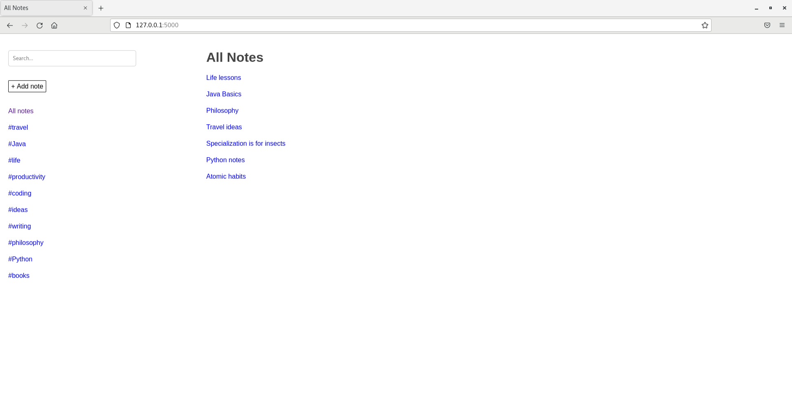
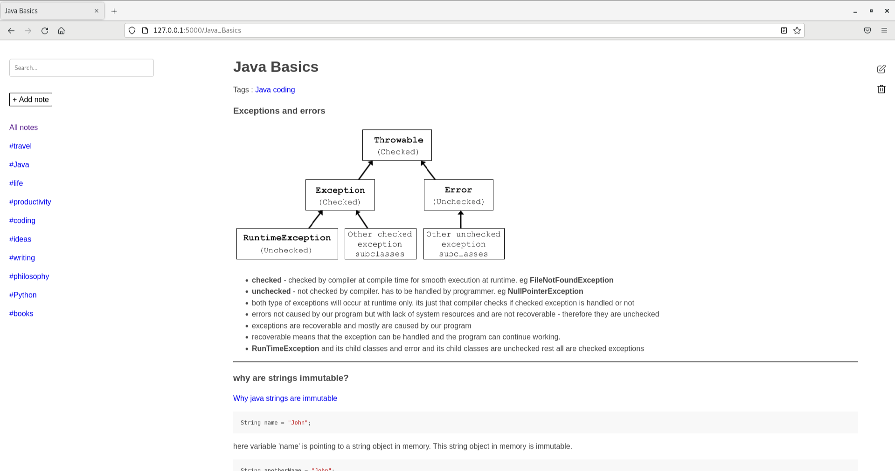

# Quilly
A simple privacy-first, self-hosted note taking webapp, written in python.





## Why

Quilly is a no-frills, open-source markdown note-taking app. It keeps things simple in a world of feature-packed and bloated alternatives. Its minimal and straightforward and does only one job - helps in taking notes.

## Features

* Markdown based
* All files saved locally
* Tag your notes
* Code highlighting

## Installation

* Clone or download the repository
* Create and activate virtual environment
* Install dependencies
```python
pip install -r requirements.txt
```
* Run
```python
python3 run.py
```

## Configuration

All notes by default are created in **data** folder. Also by default all attachments also have to be in **data** folder.
These can be changed by modifiying **config.py** file.

## Syntax

Quilly keeps things simple with the default markdown syntax for text. You can create headings, lists, and emphasize text, just as you would in any markdown editor.

### Tagging Your Notes

In Quilly, you have the option to tag your notes. The syntax is straightforward: use
```
Tags : [tag1 tag2 etc]
```
within your note to categorize it for easy reference.

### Managing Local Attachments

For local attachments, such as images, use below syntax. 
```
!()[attachments/image.png]
```
This way, you can effortlessly include images in your notes, keeping everything neatly organized.
